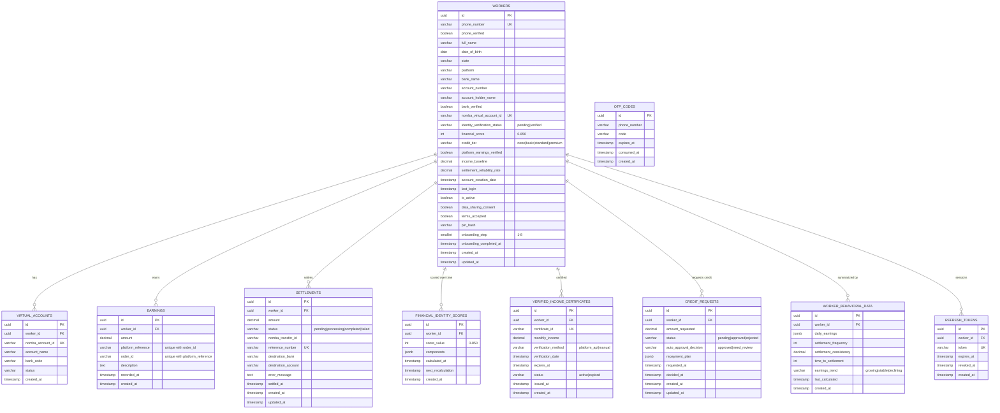

# SwiftSettle — Backend Schema Diagram

Matches `supabase/migrations/20260706000001_schema.sql` (per `BackendPrompt.md`).
This replaces the earlier Supabase-Auth-based schema — auth here is custom
JWT + Twilio OTP handled entirely by the Express backend, not Supabase Auth,
so there's no `auth.users` link; instead `refresh_tokens` and `otp_codes`
exist to support that custom flow.

